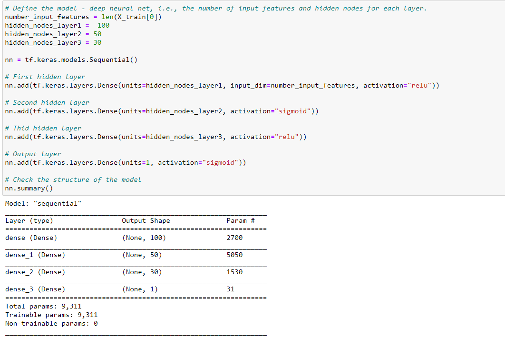
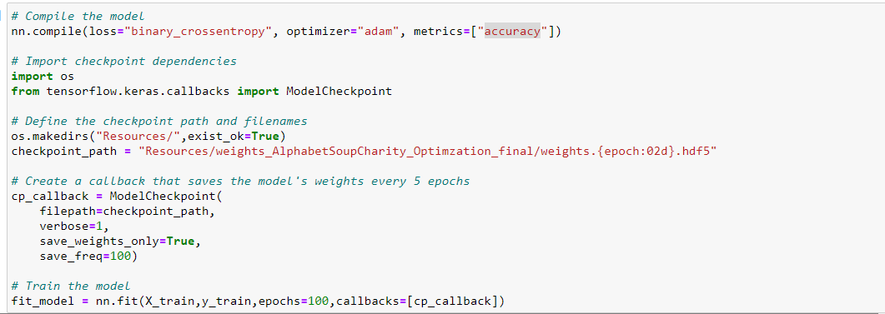
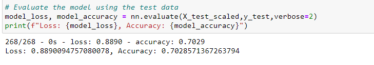

# Neural_Network_Charity_Analysis

## Overview of the analysis
The project is to apply the knowledge of machine learning and neural networks to create a binary classifier that is capable of predicting whether applicants will be successful if funded by Alphabet Soup.

## Results
* Data Preprocessing

  * What variable(s) are considered the target(s) for your model?

    The column "IS_SUCCESSFUL" was considered as the target in this analysis.

  * What variable(s) are considered to be the features for your model?

    I made three files to adjust different variable change. In the final file, I kept "APPLICATION_TYPE", "AFFILIATION", "CLASSIFICATION", "USE_CASE", "ORGANIZATION", "STATUS", "SPECIAL_CONSIDERATIONS" as features.

  * What variable(s) are neither targets nor features, and should be removed from the input data?

    In the final file, I removed "EIN", "NAME", "ASK_AMT","INCOME_AMT" from imput data.

* Compiling, Training, and Evaluating the Model

  * How many neurons, layers, and activation functions did you select for your neural network model, and why?

    In the final file, I used 100, 50, 30 neurons, and activation function relu, sigmoid, relu in the three hidden layers. And I used sigmoid in output layer. 
    
    In AlphabetSoupCharity.ipynb, I was able to achieve 69% with 80, 30 neurons with activation function both relu in hidden layer and sigmoid function in output layer. I tried to double not only neurons but also epochs in AlphabetSoupCharity_Optimzation_1st.ipynb. However, the accuracy drop to 48.5% so that I just slightly increases 20 onto neurons and kept the same epochs in the final file to fulfill the requirements of deliverable 3.

    ReLU is the most used activation function in neural networks due to its simplifying output. Then, Sigmoid identified output range between 0 and 1 so that it is a good fit since it is a binary result. I had tried in different arrangement with these two function and the result is the best with order in relu, sigmoid, relu, sigmoid.

    

    

  * Were you able to achieve the target model performance?

    No, I can't achieve 75%.

  * What steps did you take to try and increase model performance?

    I remove columns, "ASK_AMT","INCOME_AMT". Add additional neurons and hidden layers to model. As the result, the accuracy achineved 70%.

## Summary

Ultimately, I achieved 70%.

As it is mentioned in class, with all machine learning algorithms, neural networks is difficult to explain and adjust its performance. The reason could be inadequate or inappropriate model design for a given dataset, or insufficient or ineffective training data. Although collecting more training/test data is almost always beneficial, it may be impossible due to budget or logistical limitations. Therefore, the most straightforward means of improving neural network performance is tweaking the model design and parameters. Therefore, the most straightforward means of improving neural network performance is tweaking the model design and parameters.